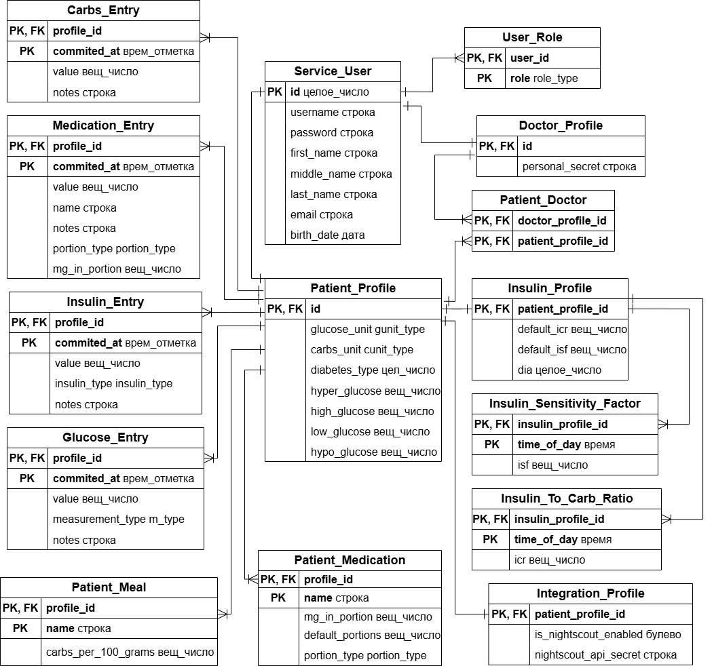
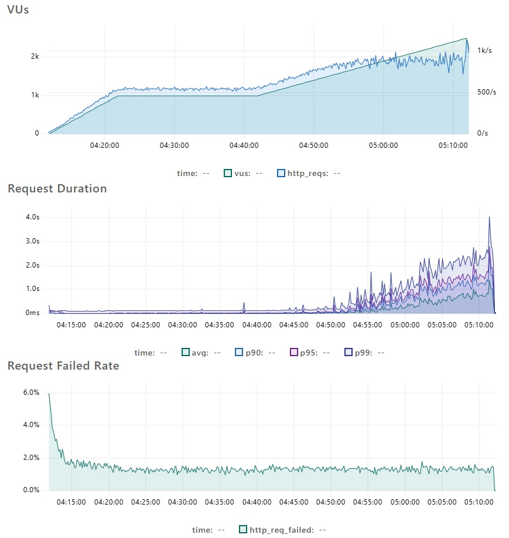

# Общая информация
Сервис позволяет больным нарушениями углеводного обмена (как сахарный диабет) вести дневник самоконтроля с возможностью учета уровня глюкозы в крови, приема углеводов или сахароснижающих препаратов, ввода инсулина, 
при этом поддерживает пользователей-врачей с удобными методами для удаленного просмотра дневника самоконтроля прикрепленных больных и статистики по нему. 

Поскольку система должна обеспечивать сетевое взаимодействие больных и врачей, а также предоставлять облачное хранилище, то необходима серверная часть, с которой уже будут обмениваться данными клиентские приложения. Потому используется клиент-серверная архитектура.
Здесь представлен Back-End, предоставляющий REST-методы для клиентов. На клиентах уже может быть реализовано локальное оффлайн-хранилище с периодической выгрузкой в Back-End. 
На данный момент для обеспечения максимальной совместимости был сделан [браузерный клиент](https://github.com/ArtLighter3/glucose-control-service-frontend). Там же доступны скриншоты, показывающие различный функционал.

# Функционал
1. Администраторская панель. Администраторы могут пользоваться
администраторской панелью для добавления, редактирования информации о
пользователях, прикрепления пациентов к врачам.
2. Регистрация и вход. Пользователи-больные и врачи могут регистрироваться в системе.
3. Дневник самоконтроля. Больные могут вести свой дневник
самоконтроля и вносить такие данные как измерение уровня глюкозы,
принятие препарата с его количеством, типом единиц препарата (таблетки, дозы, капли, впрыски, единицы,
миллилитры, чайные и столовые ложки) и названием или ввод инсулина
(короткого, среднего или длительного действия) с указанием дозы, принятие углеводов с их количеством.
Для каждой записи доступна возможность добавления собственного комментария.
4. Прикрепление больных к врачам. Администраторы могут
прикреплять больных к врачам, либо больные могут сами дать доступ к
данным дневника указанием восьмизначного личного кода врача. Врачи
могут просматривать данные дневника и статистику по ним у своих
прикрепленных пациентов.
5. Настройка профиля. Больные могут настраивать единицы измерения углеводов: хлебные
единицы (для 10, 12, 15 грамм) или граммы; единицы измерения
глюкозы: ммоль/л или мг/дл; целевые диапазоны глюкозы.
6. Визуализация данных. Больные и их врачи могут визуализировать
данные дневника c помощью графика динамики измерений за период и диаграммы распределения глюкозы по
целевым диапазонам.
7. Настройка заготовок для быстрого заполнения. Больные могут
добавлять для себя свои блюда и препараты (для быстрого заполнения
записей дневника).
8. Инсулиновый режим. Больные могут настраивать свой
инсулиновый режим, куда входят следующие параметры: углеводный
коэффициент для разного времени суток (с возможностью добавления
времени суток и значения для него с интервалом в 30 минут, начиная с 0:00), чувствительность к инсулину в разное время суток (то же
самое, что и у коэффициента), а также время действия короткого инсулина.
9. Расчет дозировки. Больные имеют
возможность рассчитать дозировку короткого инсулина для компенсации принятых
углеводов и/или достижения целевого диапазона глюкозы в крови на основе
инсулинового режима и профиля больного.
10. Интеграция с загрузчиками Nightscout. Приложение также
может работать по протоколу Nightscout API для интеграции с
приложениями-загрузчиками Nightscout, такими как xDrip, AndroidAPS.
Пользователи могут включать и настраивать свои данные для синхронизации
с загрузчиками Nightscout. Пока доступно только принятие данных от загрузчиков.

# Развертывание
Необходимо развернуть сам Back-End и СУБД (используется PostgreSQL).

## Через Docker Compose
Доступно развертывание сразу и Back-End и настроенной среды с PostgreSQL с помощью Docker Compose через файл [docker-compose.yml](docker-compose.yml), где  
необходимо выставить переменные: 
- CORS_FRONTEND_URL (адрес фронта для ответов на OPTIONS-запросы, если фронт браузерный);
- SPRING_DATASOURCE_USERNAME и POSTGRES_USER (имя пользователя для доступа к БД);
- SPRING_DATASOURCE_PASSWORD и POSTGRES_PASSWORD (пароль пользователя для БД). 

При установленном Docker и при нахождении в папке проекта запуск через
```
docker compose up -d
```
После такого развертывания сначала будет доступен суперпользователь с логином root и паролем root.

## Отдельный запуск контейнера Back-End
Необходимо сначала запустить PostgreSQL ([скрипт создания схемы БД](infrastructure/postgres/schema.sql), [скрипт для внесения root-пользователя root:root](infrastructure/postgres/data.sql)). 
Отдельная сборка и запуск Back-End - через [Dockerfile](Dockerfile).

Необходимо выставить переменные:
- CORS_FRONTEND_URL (адрес фронта для ответов на OPTIONS-запросы, если фронт браузерный);
- SPRING_DATASOURCE_URL (адрес БД);
- SPRING_DATASOURCE_USERNAME (имя пользователя для доступа к БД); 
- SPRING_DATASOURCE_PASSWORD (пароль пользователя для БД).

Сборка образа (необходима установка Docker и нахождение в папке проекта)
```
docker build -t gcs-api .
```

Запуск контейнера
```
docker run -d -p <port>:8080 gcs-api
```
где \<port\> - порт, на котором будет доступен контейнер.

## Сборка и запуск без контейнеров
Для сборки проекта с нуля можно использовать встроенный Maven Wrapper. Также необходим предварительный запуск PostgreSQL и наличие Java 21.

В [src/main/resources/application.properties](src/main/resources/application.properties) также необходимо указать адрес фронта, БД, логин и пароль для БД.

Сборка проекта
```
./mvnw clean package -DskipTests=true
```

Запуск
```
java -jar target/<target.jar>
```
\<target.jar\> - имя получившегося файла.

После запуска API станет доступно по адресу localhost:8080

# Авторизация, доступ к API
Все внешние API-методы описаны через Swagger, разметка с описанием методов, принимаемых и отдаваемых объектов доступна по адресу */api-docs* при развернутой системе. Какие-то из них доступны администраторам, какие-то только владельцам ресурса, какие-то и врачам в случае, если пациент-владелец к ним прикреплен. Выделяются роли больного, врача, администратора и суперпользователя.

На данный момент для авторизации используются сессии, поэтому для большинства методов необходима отправка куки JSESSIONID с ID сессии, которая получается при успешном логине по адресу */api/v1/auth/process-login*. Также POST, PUT, DELETE методы (в том числе для регистрации) требуют CSRF-токен в заголовке X-XSRF-TOKEN. Первоначально его можно получить GET-запросом по адресу */api/v1/auth/csrf*. После логина токен может поменяться.

Из общих принципов методов выделяется следующее: сервер отвечает с HTTP-кодом 201 в случае успешного создания какого-либо
ресурса (кроме самостоятельной регистрации, там 200 при успехе); 200 ⎯ в случае успеха метода, не связанного с созданием; 400 ⎯ если тело запроса некорректное (например, числовые данные не входят в нужный диапазон, пользователь при логине не найден или пароль неверный); 404 ⎯ запрашиваемый ресурс с такими идентификаторами не найден; 409 ⎯ создаваемый ресурс уже имеется в системе.

# Архитектура
Сервер монолитный, но разделен на модули для более легкого перехода на микросервисы в случае необходимости обеспечения большей отказоустойчивости. Модули представляют из себя отдельную директорию/пакет.

Модули:
1. Авторизация и аутентификация (Auth). По сути шлюз, принимающий запросы с проверкой прав.
Здесь находятся все контроллеры, обращающиеся к сервисам и прочим логическим классам других модулей. Так было изначально сделано для полного отделения логики авторизации с ее фильтрами от нижеследующих логических модулей, но, возможно, это не оптимальная схема, поэтому будет пересмотрена в будущем. В контроллерах модуля также выполняется преобразование внутренних объектов в DTO (с преобразованием величин в соответствии с настройками пользователя-больного) и наоборот.
2. Пользователи (Users). Хранение, выборка, модификация
информации об аккаунтах пользователей системы, их профилей для определенных ролей.
3. Дневник самоконтроля (Diary). Основной функционал для больных.
Инструменты для ведения дневника, добавления, просмотра, выборки
измерений сахара, принятых углеводов, вводов препаратов и т.д.
4. Расчеты (Calculations). Настройка режима инсулина, расчеты
доз для снижения сахара на основе принятых углеводов и текущего уровня
глюкозы.
5. Заготовки (Templates). Быстрое заполнение значений углеводов и
дозировки препаратов с помощью создания базы блюд и препаратов с уже
сохраненными значениями.
6. Интеграция (Integration). Подсистема для реализации интеграций с
другими системами. На данный момент, только с загрузчиками Nightscout. Сюда входят
настройки интеграции, а также REST-методы, разработанные по структуре
протокола Nightscout API.
7. Статистика (Statistics). Сбор статистики и аналитики по данным
дневника пользователя (например, вычисление распределений глюкозы по
целевым диапазонам).

Структура БД также составлена так, чтобы один модуль работал со своими таблицами, с которыми не работают другие напрямую. Например, настройки инсулинового режима и профиль с настройками интеграций выделены в отдельные таблицы, лишь ссылающиеся на основной профиль больного.



# Работа в нагрузке
Для тестирования использовалось средство K6. Один виртуальный пользователь сначала
регистрирует новый аккаунт, выполняет вход, получает свой профиль,
получает и обновляет инсулиновый режим, после чего начинает активно
добавлять записи дневника случайного типа, от 5 до 50 штук, с интервалом от
0.1 с до 10 с, при этом после каждого добавления производя выборку
абсолютно всех своих записей. Эти действия какое-то время выполняют 1000
пользователей, а затем их число возрастает до 2500.



Сверху зеленым цветом показано число пользователей. Посередине ⎯
средние и процентильные значения длительности запроса. При нагрузке в
1000 пользователей 99% запросов не ожидаются более 0.5 с. С последующим
нарастанием начинается более длительное ожидание, где 90% запросов
длятся не более 3 с.

Снизу изображено количество проваленных запросов в процентах.
Здесь видно, что сервер отвечает ошибками не более, чем в 2% случаев как
при пиковой нагрузке в 1000 пользователей, так и за ее пределами.

Т.е. сервер выдерживает активную одновременную работу 1000 пользователей с ожиданием, не превышающим 0.5 с.

# TODO
- возможность интеграции и с другими существующими приложениями (напр. FreeStyle Libre 2);
- обеспечение меньшей связанности модулей;
- добавление системы уведомлений;
- расширение юнит-тестов;
- добавление возможности смены пароля;
- оптимизация Dockerfile (сделать что-то с судя по всему небезопасными ENV-переменными + постоянное разделение на слои джарника в случае полной сборки через maven прямо в Dockerfile не имеет смысла);
- возможность учета активного инсулина при расчете дозировки.
